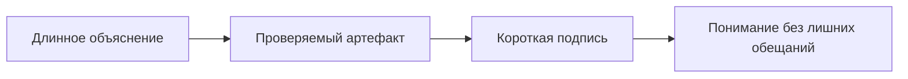
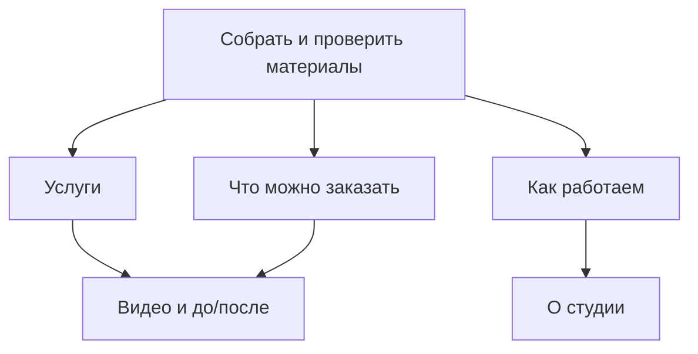
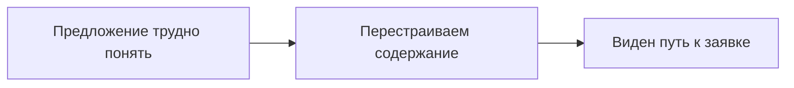
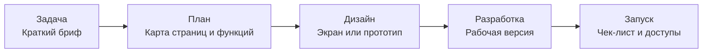
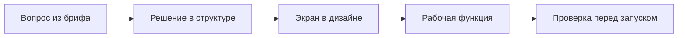

# Byte — план визуального развития

> Внутренний рабочий документ. Стратегия и порядок подготовки материалов, без изменений сайта.

## Коротко

У Byte уже есть сильная визуальная основа: узнаваемая тёмная подача, аккуратная типографика, настоящее 47-секундное видео и интерактивное сравнение «до/после». Сайт не выглядит шаблонным и не пытается убеждать вымышленными отзывами, кейсами или цифрами.

Следующий шаг — не украшать страницы случайными изображениями, а **показывать результат и способ работы там, где сейчас его приходится долго описывать текстом**. Визуальные материалы должны отвечать на один из трёх вопросов:

1. Что именно получит клиент?
2. Как будет устроена работа?
3. Почему подходу Byte можно доверять?

Главная идея:



## Что уже работает хорошо

- **Выраженный характер.** Сайт выглядит как самостоятельный цифровой продукт, а не как сборка из типовых блоков.
- **Единый визуальный язык.** Масштабная типографика, спокойная палитра и ритм секций создают цельное впечатление.
- **Видео — настоящее содержательное медиа.** В проекте уже есть 47-секундный ролик в 1920 × 1080 и 60 FPS, мобильная версия и отдельный постер.
- **Сравнение «до/после» — реальное доказательство.** Ползунок показывает изменение интерфейса без неподтверждённых чисел и рекламных заявлений.
- **Тексты говорят о понятных задачах бизнеса.** Эту конкретность важно сохранить и усилить визуальными материалами.

## Неподвижные границы стратегии

### Первый экран не меняем

Первый экран, его композиция, анимация и логика появления остаются как есть. Этот документ не содержит предложений по его переработке.

### Не используем

- выдуманные кейсы и интерфейсы, представленные как клиентские;
- отзывы без реального автора и разрешения;
- неподтверждённые проценты, сроки, рост конверсии и экономию;
- персональные профили участников команды;
- стоковые фотографии людей «за работой»;
- клиентские имена, контакты, документы, суммы, внутренние ссылки и другие закрытые сведения;
- декоративные изображения, которые не помогают понять услугу или процесс.

## Два допустимых класса материалов

| Класс | Когда использовать | Примеры |
|---|---|---|
| **Только с разрешением** | Есть согласие владельца и материал можно безопасно обезличить | Экраны клиентского сайта, личного кабинета или CRM; кадры реального процесса; мобильная версия проекта |
| **Безопасная альтернатива** | Разрешения нет, данные чувствительные или готового кейса пока нет | Собственные схемы Byte; реальные рабочие шаблоны без данных; тестовая демонстрация с явной маркировкой; карта страниц; чек-лист запуска |

**Правило:** если материал нельзя честно подписать одной фразой без оговорок, его не следует публиковать.

## Приоритетная дорожная карта

| Этап | Приоритет | Что меняется | Зачем |
|---|---:|---|---|
| 0. Инвентаризация | P0 подготовки | Собираем разрешённые экраны и рабочие артефакты | Не проектировать блоки вокруг материалов, которых нет |
| 1. «Услуги» | P1 | По одному доказательному визуальному модулю на направление | Быстрее показать содержание каждой услуги |
| 2. «Что можно заказать» | P1 | Текстовые карточки становятся карточками результата | Сделать форматы заказа различимыми с первого взгляда |
| 3. «Когда Byte может помочь» | P2 | Четыре проблемы превращаются в компактные схемы | Убрать повторяющиеся описания и показать механику решения |
| 4. «Как работаем» | P2 | Этапы связываются с реальными результатами | Показать, что клиент увидит до финального запуска |
| 5. «О студии» | P2 | Подход «одна команда» подтверждается артефактами | Создать доверие без профилей и фотографий сотрудников |
| 6. Видео и «до/после» | P2 | Добавляются главы, детали и пояснения | Усилить уже работающие визуальные доказательства |



---

## 1. Страница «Услуги»

### Рекомендуемая композиция

У каждой подробной услуги появляется один визуальный модуль одинакового формата:

- на широком экране — текст слева, визуал справа;
- на телефоне — заголовок, визуал, затем пояснение;
- один модуль показывает один сценарий, а не галерею всего подряд;
- подпись объясняет, что именно видит посетитель.

### Форматы по направлениям

| Направление | Как выглядит визуал | Что нужно собрать с разрешением | Безопасная альтернатива |
|---|---|---|---|
| **Сайты** | Три связанных кадра: первый экран, внутренняя страница, мобильная версия | Скриншоты одного опубликованного проекта, исходники достаточного размера | Реальная карта страниц Byte и обезличенный вайрфрейм с пометкой «пример структуры» |
| **Личные кабинеты** | Сценарий из трёх состояний: заявка → статус → документ или оплата | Реальные экраны, очищенные от имён, сумм, номеров и документов | Собственная демонстрация на тестовых данных с подписью «демонстрационный сценарий» |
| **Системы для сотрудников** | Один общий экран и два увеличенных фрагмента: фильтр, карточка, отчёт | Скриншот реального продукта и перечень разрешённых элементов | Схема сущностей «заявка / задача / документ / ответственный» и нейтральный UI-прототип |
| **ИИ и автоматизация** | Поток: входящие данные → обработка → проверка человеком → передача результата | Реальный тип документа или заявки, фактические шаги и экран проверки | Схема процесса на безопасном тестовом документе без показателей эффективности |
| **Telegram** | Три кадра реального диалога или короткая запись работы бота | Работающий бот, тестовый чат и разрешённый сценарий | Схема возможностей без имитации существующего клиента |

### Визуальная конструкция модуля

```text
┌──────────────────────────────────────┐
│  Крупный реальный экран              │
│                              ┌─────┐ │
│                              │деталь│ │
│                              └─────┘ │
├──────────────────────────────────────┤
│  Что показано · зачем это клиенту    │
└──────────────────────────────────────┘
```

### Чего избегать

- собирать «идеальный» интерфейс, который Byte ещё не разрабатывал;
- помещать в мокап логотип случайной компании;
- использовать интерфейс без подписи — посетитель не обязан угадывать его смысл;
- показывать много мелких экранов одновременно;
- маскировать тестовые данные под реальные.

---

## 2. Страница «Что можно заказать»

Сейчас форматы различаются в основном текстом. Задача — превратить каждый блок в **карточку результата**, которая показывает не абстрактную услугу, а состав того, что будет создано.

| Формат заказа | Основной визуальный формат | Что должно быть видно |
|---|---|---|
| **Одностраничный сайт** | Вертикальный фрагмент страницы с тремя выносками | Предложение, аргументы, действие посетителя |
| **Сайт компании** | Мини-карта разделов и два реальных экрана | Как содержание распределяется по страницам |
| **Личный кабинет** | Три последовательных состояния | Что клиент делает самостоятельно и где видит результат |
| **Система сотрудников** | Схема сущностей и один фрагмент интерфейса | Как связаны заявка, задача, документ и ответственный |
| **ИИ-помощник** | Источник → черновик → проверка | Где заканчивается автоматизация и начинается контроль человека |
| **Автоматизация заявок** | Событийная схема сервисов | Откуда приходит заявка, куда передаётся и кто получает уведомление |

### Рекомендуемый вид карточки

```text
01 / Сайт
Одностраничный сайт

[ визуальная превью-зона результата ]

Что решает
Одно короткое предложение.

На выходе
Текст · дизайн · мобильная версия · запуск
```

Карточка не должна утверждать, что изображение относится к клиенту, если это демонстрация. Для тестового материала используется видимая подпись: **«Демонстрация формата»**.

---

## 3. «Когда Byte может помочь»

### Вариант A — рекомендуемый: «Сейчас → работа Byte → новое состояние»

Каждая из четырёх ситуаций становится коротким маршрутом из трёх узлов.



Четыре маршрута:

1. Предложение трудно понять → перестраиваем содержание → виден путь к заявке.
2. Идея пока без структуры → собираем сценарий → появляется первая проверяемая версия.
3. Работа разбросана по таблицам → объединяем статусы → процесс виден в одном месте.
4. Операции повторяются вручную → задаём правила автоматизации → сотрудник проверяет сложные случаи.

**Почему это лучший вариант:** схема объясняет механизм помощи, не обещает неподтверждённый коммерческий результат и хорошо складывается в вертикальный маршрут на мобильном.

### Вариант B: матрица «Симптом / Что создаём»

Компактная таблица 2 × 2. В каждой ячейке — пиктограмма, симптом и конкретный артефакт: структура сайта, прототип, единая система или правила автоматизации.

### Вариант C: карточки «Проблема / Решение»

По нажатию или наведению карточка меняет состояние. Вариант эффектный, но требует больше взаимодействия и хуже показывает все четыре ситуации одновременно. Использовать только если интерактивность действительно поддерживает общий ритм сайта.

### Реализация

- HTML и CSS для структуры;
- тонкая SVG-линия и простые геометрические символы;
- не больше 8–10 слов в одном узле;
- анимация может подсвечивать путь, но не должна быть нужна для понимания;
- на мобильном три узла становятся вертикальными.

---

## 4. «Как работаем»

### Рекомендуемый формат: линия проверяемых артефактов

Процесс следует показывать не только названиями этапов, но и тем, что клиент реально увидит на каждом из них.



### Артефакты этапов

| Этап | Что показываем | Безопасный вариант |
|---|---|---|
| Задача | Фрагмент реального брифа без названий и контактов | Собственный шаблон вопросов Byte |
| План | Карту страниц, функций или ролей | Обобщённую схему типового проекта |
| Дизайн | Реальный экран или кликабельный прототип | Компоненты собственной дизайн-системы |
| Разработка | Рабочую версию в браузере | Локальную демонстрацию на тестовых данных |
| Запуск | Релизный чек-лист и структуру передаваемых материалов | Универсальный чек-лист Byte без адресов и доступов |

### Дополнительные варианты

- **Лента одного проекта:** слева исходные материалы, справа опубликованный результат, между ними пять состояний.
- **Аккордеон для телефона:** один этап занимает одну строку; при раскрытии появляются артефакт и результат этапа.
- **Вертикальный маршрут:** этапы соединены одной линией, миниатюры чередуются слева и справа.

Лучше начать с единой линии: она проще, понятнее и может использовать те же материалы, что и раздел «О студии».

---

## 5. «О студии» без персональных профилей

Подход «одна команда» можно подтвердить без лиц, имён и биографий. Нужно показать, что решения и контекст проходят через весь проект без разрывов.

### Вариант A — рекомендуемый: «единая нить проекта»

Одна линия проходит через исследование, текст, дизайн, разработку и запуск. Возле каждого этапа — реальный артефакт одного и того же проекта.



Это визуально доказывает непрерывность работы сильнее, чем групповая фотография или список ролей.

### Вариант B: «рабочий стол проекта»

Коллаж из четырёх настоящих материалов:

- обезличенная заметка или бриф;
- фрагмент Figma;
- рабочая версия в браузере;
- чек-лист запуска.

Все материалы должны относиться к одному проекту. Тогда коллаж воспринимается как доказательство процесса, а не как декоративный мудборд.

### Вариант C: «один контекст»

В центре находится задача проекта, вокруг — аналитика, текст, дизайн, разработка и проверка. Связи показывают, что каждая функция опирается на одни и те же исходные решения.

### Вариант D: процесс без людей

Реальные кадры предметов и экранов: заметки, макет, проверка на телефоне и компьютере, релизный список. Никаких постановочных рук у ноутбука и стокового офиса.

### Что потребуется

- 3–5 материалов из одного проекта;
- разрешение на публикацию или полностью безопасный собственный проект;
- список скрываемых данных;
- единый способ кадрирования;
- короткие подписи, связывающие каждый материал с решением.

---

## 6. Развитие видео

### Что уже есть в проекте

- `assets/video/byte-system-overview.mp4` — 1920 × 1080, 60 FPS, 47 секунд;
- `assets/video/byte-system-overview-mobile.mp4` — мобильная версия;
- `assets/video/byte-system-overview-poster.jpg` — постер 1920 × 1080.

Это готовая база: новый вымышленный материал не требуется.

### Что можно добавить

1. **Содержательный постер.** Выбрать кадр, который сразу показывает продукт или ключевую мысль ролика.
2. **Полосу из трёх глав.** Три стоп-кадра непосредственно из видео с реальными таймкодами.
3. **Короткое содержание.** Например: «идея / интерфейс / запуск» — только если главы действительно соответствуют ролику.
4. **Увеличенные детали.** Вынести рядом два интерфейсных фрагмента, уже присутствующих в видео.
5. **Компактную мобильную подачу.** Постер, кнопка воспроизведения и полоса глав вместо дополнительного длинного текста.

### Безопасность

- кадры берутся только из опубликованного ролика;
- подписи описывают увиденное, а не заявляют эффективность;
- если внутри видео есть данные, перед созданием стоп-кадров их нужно отдельно проверить;
- главы не должны обещать то, чего ролик не показывает.

---

## 7. Развитие сравнения «до/после»

### Что уже есть в проекте

- `assets/comparison/slm-before.png` — 2560 × 1428;
- `assets/comparison/slm-after.png` — 1672 × 941;
- интерактивный ползунок, позволяющий сравнивать обе версии.

### Форматы усиления

#### 1. Проверяемые выноски

Добавить до трёх подписей, указывающих на реально видимые изменения:

- контакты стали заметнее;
- навигация стала проще;
- основное предложение читается яснее.

Каждая формулировка проверяется по обеим версиям. Если различие нельзя показать курсором или рамкой, подпись лучше убрать.

#### 2. Вкладки деталей

Три пары кропов из тех же изображений:

- первый экран;
- навигация;
- контакты.

Так посетителю не придётся разбирать мелкий текст на полном скриншоте.

#### 3. Локальная лупа

При движении ползунка выбранная область увеличивается. Формат подходит для мелких различий, но не должен мешать основной механике сравнения.

#### 4. Мобильная пара

Добавлять только при наличии настоящих мобильных скриншотов обеих версий. Не дорисовывать мобильную версию задним числом ради полноты кейса.

#### 5. Маршрут пользователя

Поверх изображений можно показать короткий путь: предложение → нужный раздел → контакт. Маршрут должен соответствовать реальной структуре обеих версий.

### Главное правило

Один подробно объяснённый реальный пример сильнее трёх сомнительных кейсов. Новые сравнения добавляются только после получения исходников и разрешения владельца.

---

## Единая система визуальных форматов

Чтобы сайт не превратился в коллекцию разных приёмов, достаточно четырёх повторяемых форматов:

| Формат | Где использовать | Назначение |
|---|---|---|
| **Экран + детали** | «Услуги», «Что можно заказать» | Показать интерфейс и важные части |
| **Три состояния** | Личные кабинеты, Telegram, ИИ | Показать последовательность действий |
| **Линия процесса** | «Когда Byte может помочь», «Как работаем», «О студии» | Показать причинно-следственную связь |
| **Парное сравнение** | «До/после» | Показать конкретное изменение |

### Общие правила оформления

- один доминирующий визуал на секцию;
- подпись отвечает на вопрос «что именно здесь показано»;
- одинаковые радиусы, рамки, фон и принцип увеличения деталей;
- текст внутри изображений остаётся читаемым на телефоне;
- на мобильном визуал появляется до длинного пояснения;
- анимация усиливает связь между элементами, но не скрывает содержание;
- у тестовых материалов всегда есть явная маркировка.

## Проверка материала перед публикацией

Для каждого изображения или видео нужно заполнить короткую карточку:

```text
Название:
Источник:
Владелец:
Разрешение на публикацию:
Что показано:
Что необходимо скрыть:
Реальные или тестовые данные:
Актуальность материала:
Где используется на сайте:
```

Материал допускается к работе только после ответов на все пункты.

## Что собрать сначала

1. **Один опорный проект**, для которого сохранились план, дизайн, рабочая версия и итоговый запуск.
2. **Разрешение владельца** или решение использовать только полностью обезличенные фрагменты.
3. **Desktop- и mobile-скриншоты** в исходном разрешении.
4. **Один реальный сценарий личного кабинета или системы** из трёх последовательных состояний.
5. **Карту страниц или функций**, которую можно показать без клиентских данных.
6. **Шаблон брифа и чек-лист запуска Byte** без заполненных персональных сведений.
7. **Три стоп-кадра из текущего видео** с подтверждёнными таймкодами.
8. **Три пары кропов текущего сравнения**: первый экран, навигация, контакты.
9. **Список запрещённых к публикации данных** для каждого источника.

## Что делать по порядку

### Шаг 1. Инвентаризация

Собрать материалы в одной таблице, определить права, актуальность и объём обезличивания. Не начинать дизайн новых модулей, пока не понятен реальный набор доказательств.

### Шаг 2. Опорный визуальный модуль

На одном направлении страницы «Услуги» собрать формат «экран + детали + подпись». Проверить, что он читается на компьютере и телефоне.

### Шаг 3. Масштабирование на «Услуги»

Применить тот же принцип к оставшимся направлениям, не меняя формат от секции к секции без необходимости.

### Шаг 4. Карточки результата

Перенести подготовленные материалы на страницу «Что можно заказать» и различить шесть форматов визуально.

### Шаг 5. Процесс и подход

Из артефактов одного проекта собрать «Как работаем» и «О студии». Один комплект материалов должен подтверждать оба раздела.

### Шаг 6. Компактные схемы задач

Перевести «Когда Byte может помочь» в четыре маршрута «сейчас → действие → новое состояние».

### Шаг 7. Усиление готовых доказательств

Добавить главы и стоп-кадры к видео, затем — проверяемые выноски и кропы к текущему «до/после».

### Шаг 8. Финальная редактура

Проверить, не повторяют ли визуалы один и тот же смысл, убрать лишние подписи и убедиться, что ни один материал не воспринимается как вымышленный клиентский кейс.

## Критерий готовности стратегии

Визуальное развитие можно считать удачным, если посетитель без чтения длинных абзацев понимает:

- какие продукты создаёт Byte;
- что входит в каждый формат заказа;
- какой результат появляется на каждом этапе работы;
- почему «одна команда» означает сохранение общего контекста;
- какие изменения подтверждаются настоящим видео и сравнением;
- где показан реальный материал, а где честная демонстрационная схема.

Цель — не сделать сайт визуально громче. Цель — сделать опыт Byte **видимым, конкретным и доказательным**.
